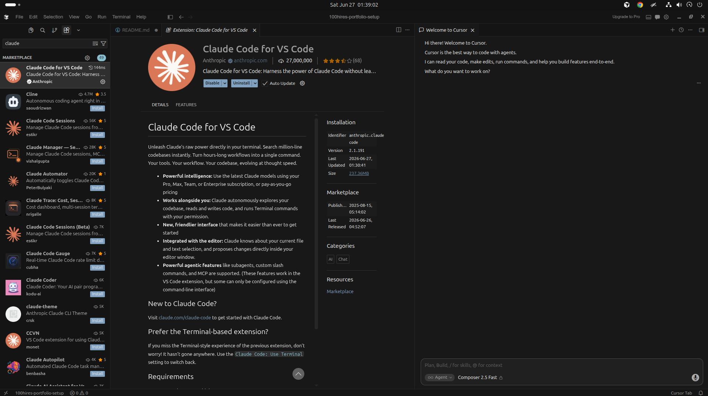
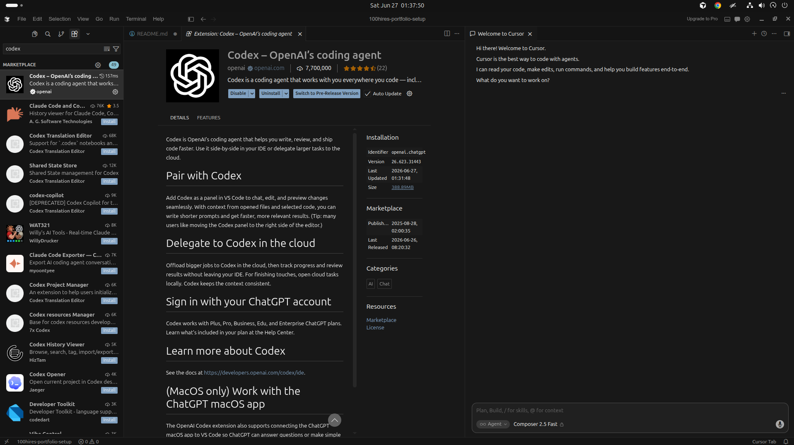

# 100Hires Portfolio Setup

## Objective

This repository documents the setup process for modern AI-assisted development tools as part of the portfolio project assignment.

The goal was to install and configure the required tools, document the process, and record any issues encountered along the way.

---

## Installed Tools

### 1. Cursor IDE

Installed successfully and used as the main development environment.

### 2. Claude Code Extension

Installed through Cursor Extensions and authenticated successfully.

Screenshot:

### 3. Codex Extension

Installed through Cursor Extensions and authenticated successfully.

Screenshot:

---

## Steps Completed

* Created a public GitHub repository
* Opened the repository inside Cursor IDE
* Installed Claude Code extension
* Installed Codex extension
* Logged into both extensions
* Created project documentation in README.md
* Prepared repository for commit and push

---

## Challenges & Solutions

### Challenge 1 — Extension setup and authentication

Some extensions required account authentication before becoming available.

**Solution:**
Followed the onboarding flow and completed authentication before proceeding.

### Challenge 2 — Keeping the repository focused

Initially considered adding unnecessary files and complexity.

**Solution:**
Kept the repository minimal and documented only the requested deliverables.

---

## Research & AI Usage

During this setup process, I used a combination of official documentation, extension onboarding instructions, and AI assistance.

AI tools were used to help organize notes and improve documentation clarity, while installation, verification, troubleshooting, and final decisions were completed manually.

My approach:

1. Read instructions carefully
2. Search for missing information when necessary
3. Execute and verify each step
4. Document results clearly

This reflects how I normally work: use tools to accelerate execution while maintaining ownership of the final outcome.

---

## Reflection

This exercise emphasized practical skills beyond coding:

* Following written instructions
* Setting up development environments
* Using AI-assisted developer tools
* Researching independently
* Documenting work clearly
* Managing projects with Git and GitHub

Repository completed within the required timeframe.
